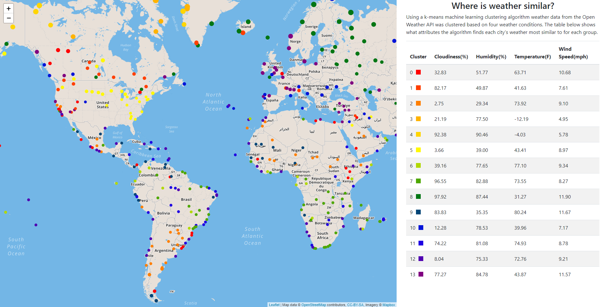

# Weather-Clustering
This visualization shows the results of a k-means clustering machine learning algorithm on temperature, humidity, cloudiness and wind speed for randomly selected cities. 

kmeans.py was used to generate data and cluster the data. logic.js and details.js were used to render the visualization.

 ### Data Generation
Cities were selected by randomizing lattitude and longitude values and using the [citipy](https://pypi.org/project/citipy/ "citipy info page") python library to find the nearest city to each generated coordinate pair. City names were used to call the [Open Weather Map API](https://openweathermap.org/api "OpenWeatherMap API Website") for the current weather for each city. Repeated cities and cities that the API failed to recognize were discarded.

### Clustering
The four weather factors recieved from each API call and the city's coordinates were stored in a Python pandas dataframe. Using a [scikit-learn k-means](https://scikit-learn.org/stable/modules/generated/sklearn.cluster.KMeans.html "Module Documentation") clustering algorithm the four weather factors were clustered. The number of clusters was determined programmatically by defining a threshold where increasing k yeilded a decrease in the [inertia](# "Inertia is the sum of squared distances of samples to their closest cluster center.") of less than 5%. The data was clustered into k clusters and labeled in a new column of the dataframe by cluster number. The program then output two csv files, one of the dataframe and one of the centers of the k clusters. 

### Visualization
The table loads data from Weather_Centers.csv and assigns a color to each cluster center using the [chroma.js](https://gka.github.io/chroma.js/ "Chroma.js Documentation") library to automtically scale a specturm to the number of clusters generated. 
The map was created using [Leaflet](https://leafletjs.com/ "Leaflet.js Website"). Leaflet's Circle method was used to add a circle to the map for each city with the color corresponding to the color assigned to each cluster in the table. Each circle has data bound to it in a popup based on Global_Weather.csv.

### Limitations 
Due to the limit of 60 API calls per minute with a free key we chose not to enable this visualization to update to live weather conditions. The data on this dashboard was gathered on February 22 2020.
